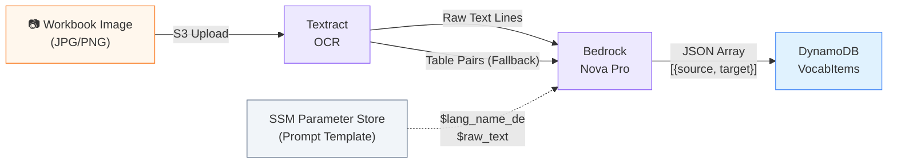
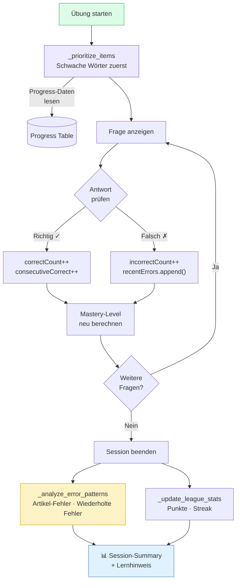
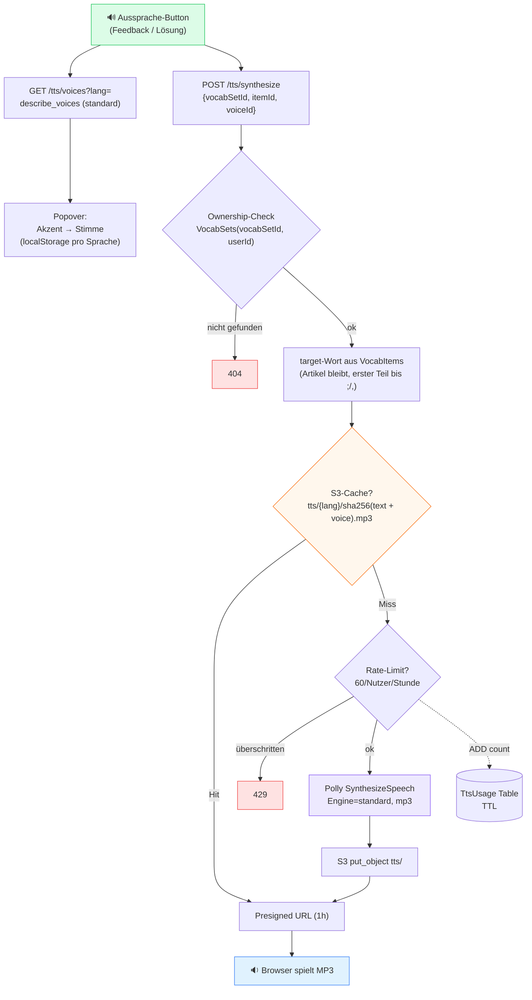
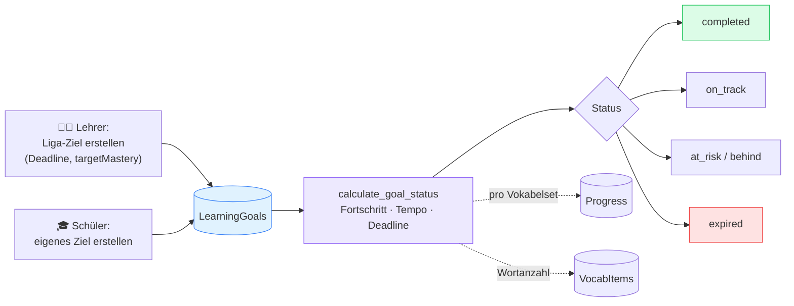
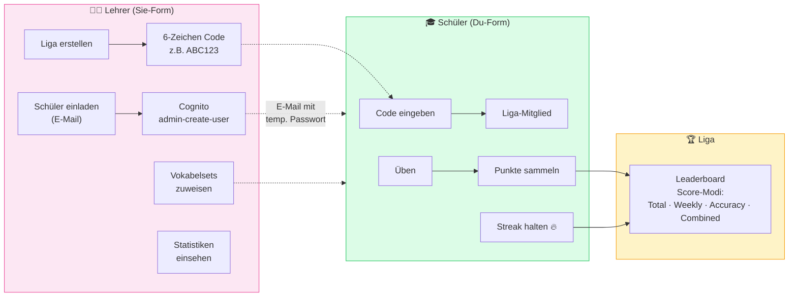

# VocabGym — Architektur

## Systemübersicht

```mermaid
graph TB
    subgraph Client["🖥️ Client Browser"]
        FE["Vue 3 SPA<br/>Tailwind CSS · Pinia · Vue Router"]
    end

    subgraph AWS["☁️ AWS (eu-central-1)"]
        subgraph CDN["CloudFront CDN"]
            CF["Distribution<br/>vocab.gym.t3r.de"]
        end

        subgraph Auth["Cognito"]
            UP["User Pool<br/>OAuth2 + Hosted UI"]
            TG["teachers Group"]
        end

        subgraph API["API Gateway (REST)"]
            GW["Cognito Authorizer<br/>JWT Validation"]
        end

        subgraph Lambda["Lambda Functions (Python 3.11, x86_64)"]
            UH["upload_handler"]
            EH["extraction_handler"]
            VH["vocab_crud_handler"]
            PH["practice_handler"]
            PRH["progress_handler"]
            LH["league_handler"]
            GH["goal_handler"]
            POH["polly_handler"]
        end

        subgraph Storage["Storage"]
            S3F["S3: Frontend<br/>(Static Assets)"]
            S3I["S3: Images<br/>(Workbook Scans + TTS-Cache tts/)"]
        end

        subgraph AI["AI / OCR / Speech"]
            TX["Textract<br/>(OCR)"]
            BR["Bedrock<br/>Amazon Nova Pro<br/>(Vocab Extraction)"]
            PLY["Polly<br/>(Text-to-Speech,<br/>Standard Engine)"]
        end

        subgraph DB["DynamoDB (9 Tables)"]
            UT["Users"]
            VS["VocabSets"]
            VI["VocabItems"]
            PS["PracticeSessions"]
            PT["Progress"]
            LT["Leagues"]
            LM["LeagueMembers"]
            GT["LearningGoals"]
            TU["TtsUsage"]
        end

        subgraph Config["Configuration"]
            SSM["SSM Parameter Store<br/>(LLM Prompts)"]
            R53["Route 53<br/>(DNS)"]
        end
    end

    FE -->|HTTPS| CF
    CF -->|Static Files| S3F
    FE -->|"Authorization: Bearer JWT"| GW
    FE -->|OAuth2 Flow| UP
    GW -->|Validate JWT| UP
    GW --> UH & EH & VH & PH & PRH & LH & GH & POH

    UH -->|Presigned URL| S3I
    EH -->|Analyze Document| TX
    EH -->|Converse API| BR
    EH -->|Load Prompts| SSM
    LH -->|AdminCreateUser| UP

    UH --> VS
    EH --> VS & VI
    VH --> VS & VI & PT & LT & UT
    PH --> VI & PS & PT & LM & UT
    PRH --> PT & PS & VS & VI
    LH --> LT & LM & UT
    GH --> GT & PT & VS & VI & UT & LT & LM
    POH -->|SynthesizeSpeech / DescribeVoices| PLY
    POH -->|"MP3-Cache tts/ + Presigned URL"| S3I
    POH --> VS & VI & TU

    R53 -->|A Record ALIAS| CF

    style Client fill:#e0f2fe,stroke:#0284c7
    style AWS fill:#f8fafc,stroke:#94a3b8
    style CDN fill:#fef3c7,stroke:#f59e0b
    style Auth fill:#fce7f3,stroke:#ec4899
    style API fill:#f3e8ff,stroke:#a855f7
    style Lambda fill:#dcfce7,stroke:#22c55e
    style Storage fill:#fff7ed,stroke:#f97316
    style AI fill:#ede9fe,stroke:#8b5cf6
    style DB fill:#e0f2fe,stroke:#3b82f6
    style Config fill:#f1f5f9,stroke:#64748b
```



## Vocabulary Extraction Pipeline



**Ablauf:**
1. Schüler lädt Workbook-Foto hoch (S3 Presigned URL)
2. **Textract** extrahiert den gesamten Text (LINE-Blöcke) + versucht Tabellen-Parsing
3. **Bedrock (Nova Pro)** bekommt den Roh-OCR-Text und extrahiert intelligente Vokabelpaare
4. Prompt-Template wird aus **SSM Parameter Store** geladen (änderbar ohne Deploy)
5. Falls Bedrock mehr Paare findet als Textract-Tabellen → Bedrock-Ergebnis wird verwendet
6. Ergebnisse werden in DynamoDB gespeichert, Schüler reviewt im Frontend

## Practice Session mit Smart Repetition



**Priorisierung:**
- `priority = (5 - mastery) + recentErrors * 1.5 + errorRate * 2.0 - consecutiveCorrect * 0.5 + random(0, 1.5)`
- Neue Wörter: mittlere Priorität (5.0)
- Schwache Wörter erscheinen zuerst

**Neue Wörter (`isNew`):** `handle_start` liefert pro Frage ein `isNew`-Flag (true, wenn `correctCount == 0`, also noch nie richtig beantwortet). Für neue Wörter bietet das Frontend „Lösung zeigen" sofort an (ohne Streak-Bedingung) und spielt die Aussprache automatisch ab — bei bekannten Wörtern bleibt „Vorsagen" ab 2 richtigen in Folge.

## Aussprache (Text-to-Speech mit Polly)



**Merkmale:**
- **Nur Fremdsprache:** Es wird ausschließlich das Zielsprach-Wort vorgelesen (Richtung Deutsch → Fremdsprache), nie das deutsche Quellwort.
- **Missbrauchsschutz:** Der Endpoint akzeptiert keinen freien Text — das zu sprechende Wort wird serverseitig aus dem (eigenen) VocabItem gelesen; VoiceId wird gegen die Standard-Stimmen der Sprache validiert; Textlänge begrenzt.
- **Rate-Limit:** 60 echte Synthesen pro Nutzer und Stunde (nur Cache-Misses zählen) über die `TtsUsage`-Tabelle (TTL); Überschreitung → HTTP 429.
- **Cache:** MP3s liegen unter `tts/{lang}/{sha256(text|voiceId)}.mp3` im Images-Bucket, Auslieferung per Presigned URL (1 h); S3-Lifecycle löscht `tts/` nach 30 Tagen.
- **Stimmen dynamisch:** `describe_voices` (Standard-Engine), gruppiert nach Akzent (z. B. en-GB/en-US/en-AU); Auswahl von Akzent + Stimme wird pro Zielsprache in localStorage gemerkt.

## Lernziele (Learning Goals)



**Merkmale:**
- Ziele bündeln ein oder mehrere Vokabelsets mit einer Deadline und einem Ziel-Mastery-Level (3–5).
- `calculate_goal_status` aggregiert den Fortschritt über alle Sets, berechnet Tempo (gemeisterte Wörter pro Tag) vs. benötigtes Tempo und leitet einen Status ab: `completed`, `on_track`, `at_risk`, `behind`, `expired`.
- Lehrkräfte können einer Liga ein Ziel zuweisen und den Fortschritt aller Mitglieder einsehen (`GET /goals/{goalId}/members`).

## Liga-System



**Einladungen (invite-only):** Der Userpool erlaubt keine Selbstregistrierung
(`AdminCreateUserOnly`). Konten werden ausschließlich von Lehrkräften angelegt;
das Backend erzeugt den Cognito-User via `admin_create_user` (Cognito versendet
die Einladungsmail mit temporärem Passwort). Zwei Wege, beide teacher-only im
`league_handler`:
- `POST /users/invite` — Onboarding **ohne** Liga (Konto anlegen)
- `POST /league/{leagueId}/invite` — Konto anlegen **und** der Liga hinzufügen

## DynamoDB-Schema

```mermaid
erDiagram
    Users {
        string userId PK
        string displayName
        string leagueId
        string role
    }

    VocabSets {
        string vocabSetId PK
        string userId SK
        string title
        string targetLanguage
        list imageKeys
        string extractionStatus
        number itemCount
    }

    VocabItems {
        string vocabSetId PK
        string itemId SK
        string source
        string target
        number order
        string imageKey
    }

    Progress {
        string progressKey PK
        string itemId SK
        number correctCount
        number incorrectCount
        number masteryLevel
        list recentErrors
    }

    PracticeSessions {
        string userId PK
        string sessionId SK
        string vocabSetId
        number score
        number duration
        list detailedResults
    }

    Leagues {
        string leagueId PK
        string joinCode
        string teacherUserId
        string scoreMode
        list vocabSetIds
    }

    LeagueMembers {
        string leagueId PK
        string userId SK
        string displayName
        number totalCorrect
        number currentStreak
    }

    LearningGoals {
        string goalId PK
        string userId SK
        list vocabSetIds
        string deadline
        number targetMastery
        string leagueId
    }

    TtsUsage {
        string userId PK
        string windowStart SK
        number count
        number expiresAt
    }

    Users ||--o{ VocabSets : "owns"
    VocabSets ||--o{ VocabItems : "contains"
    Users ||--o{ PracticeSessions : "practices"
    Users ||--o{ Progress : "tracks"
    Leagues ||--o{ LeagueMembers : "has"
    Users ||--o| LeagueMembers : "member of"
    Leagues }o--o{ VocabSets : "assigns"
    Users ||--o{ LearningGoals : "sets"
    Leagues ||--o{ LearningGoals : "assigned to"
    Users ||--o{ TtsUsage : "rate-limited by"
```

## Technologie-Stack

| Schicht | Technologie |
|---------|-------------|
| **Frontend** | Vue 3 (Composition API), Tailwind CSS, Pinia, Vite |
| **CDN** | CloudFront + S3 (custom domain via Route 53) |
| **Auth** | Cognito User Pool (OAuth2, teachers Group, AdminOnly Signup) |
| **API** | API Gateway (REST) + Cognito Authorizer |
| **Backend** | 8× Lambda (Python 3.11, x86_64) + SharedLayer |
| **AI/OCR** | Textract (OCR) → Bedrock Nova Pro (Vocab Extraction) |
| **Sprachausgabe** | Polly (Text-to-Speech, Standard-Engine, MP3-Cache in S3) |
| **Datenbank** | DynamoDB (9 Tabellen, On-Demand Billing) |
| **Prompts** | SSM Parameter Store (änderbar ohne Deploy) |
| **IaC** | AWS SAM (CloudFormation) |
| **Deploy** | `./deploy.sh dev|prod` |
